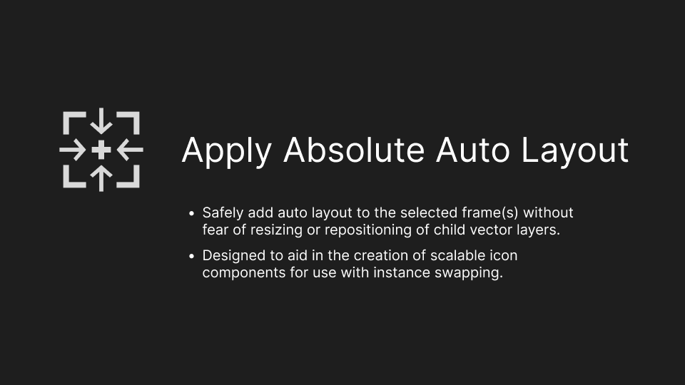

Apply autolayout to your icons without risk of resizing or elements repositioning!

---

# Apply Absolute Auto Layout

Have you ever applied auto layout to an icon frame, only for it to resize the frame and reposition the vectors inside of it? Here is the solution to your auto layout woes!

This plugin applies the following to each selected frame:

1. Set auto layout, center alignment on both axes, fixed width and height, and restore original frame dimensions
1. For each immediate vector child layer, apply absolute positioning and restore original x/y coordinates within the parent frame

And that's it!
